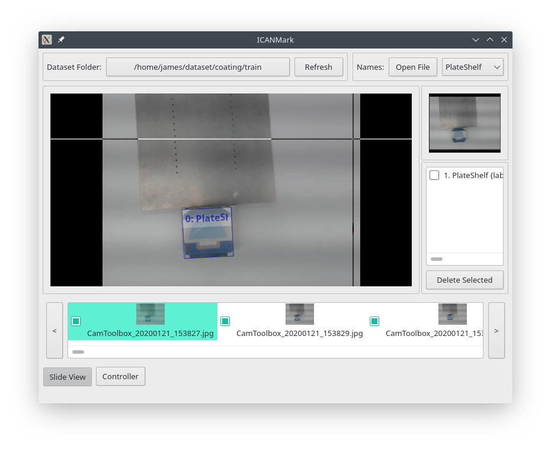

# 準備資料集

此章節將介紹資料集準備的部份。

在此提供範例資料集以供參考：

-   [coating 旋轉物件資料集](https://drive.google.com/file/d/1FBhiYQWKvWbFCb3NXIB5D8G7X6xrV0XX/view?usp=sharing)
-   [PlateShelf 旋轉角度資料集](https://drive.google.com/file/d/13KLxya8XHXKYWKNs-0ybg0xYtW50wXSq/view?usp=sharing)

## 資料集格式

YORO 專案採用的資料標記模式為一張影像搭配一個標注檔，
檔案名稱為 `完整影像名稱.mark`，檔案內容使用 YAML 格式。  
標注檔以列表方式紀錄所有物件的 Ground Truth，
若檔案內容為空，則整張影像將視為沒有物件的背景影像。

標記欄位：

-   label: 類別ID (整數)
-   degree: 旋轉角度 (Degree, 浮點數)
-   x: 中心 X 座標 (Pixel, 浮點數)
-   y: 中心 Y 座標 (Pixel, 浮點數)
-   w: 寬度 (Pixel, 浮點數)
-   h: 高度 (Pixel, 浮點數)

標注範例：

一張含有2個不同物件的影像，且檔案名稱為 `foo.jpg`，
則標注檔案名稱與內容範例如下：

`foo.jpg.mark`

```yaml
- label: 1
  degree: -48.031149508305518
  x: 355.28046421663441
  y: 183.71134020618558
  w: 139.4423356941823
  h: 97.687241339850686
- label: 0
  degree: 42.114551599074474
  x: 173.61702127659578
  y: 337.42268041237116
  w: 123.53840472389126
  h: 120.85490095921293
```

另外，一個資料集會搭配一個類別名稱檔案，內容依然使用 YAML 格式，
如：  

`data.names`

```yaml
- person
- cat
- dog
```

## 準備資料標記程式

ican_mark 提供搭配鍵盤與滑鼠標記資料的功能：  
<https://github.com/jamesljlster/ican_mark>

相依套件：

-   Qt5: <https://www.qt.io/>
-   yaml-cpp: <https://github.com/jbeder/yaml-cpp>

編譯套件：

```bash
git clone https://github.com/jamesljlster/ican_mark.git
cd ican_mark

mkdir build && cd build
cmake ..
cmake --build . --target install
```

編譯完成後，ican_mark 執行檔預設會安裝於 build/install/bin 目錄下。

## 標記資料

首先蒐集訓練即驗證影像資料，並為自己的資料集準備好類別名稱列表，
在此以 coating 資料集作為範例。

建議資料集目錄結構：

    coating
      ├── coating.names
      ├── train
      │     ├── CamToolbox_20200121_153827.jpg
      │     ├── CamToolbox_20200121_153829.jpg
      │     ├── ...
      │
      └── valid
            ├── CamToolbox_20200121_153830.jpg
            ├── CamToolbox_20200121_153843.jpg
            ├── ...

其中 `coating.names` 的內容為：

```yaml
- PlateShelf
- CoatingBar
```

執行 ical_mark，
點擊 Dataset Folder: Open Directory 與 Names: Open File 選擇影像資料夾以及類別列表檔案：



標記方式為使用滑鼠左鍵點擊 4 次決定一個選轉物件框，
前 2 點決定角度，後 2 點決定方框。  
標記的類別以 Names 列表中選擇的項目決定。

詳細操作方式：

-   滑鼠
    -   使用左鍵標記
    -   使用滾輪縮放影像
    -   壓著中鍵拖曳影像
-   鍵盤
    -   WASD 可移動影像
    -   ESC 可重設視窗 Focus 元件，當發現快速鍵無法使用時按下去就對了
    -   R 可回到上一步的標記動作
    -   Backspace 可直接清除目前未完成的標記
    -   Up, Down, Shift 可更換標記的類別
    -   Left, Right, Space 可切換標記影像
    -   Z 可將目前的影像縮放至符合視野
